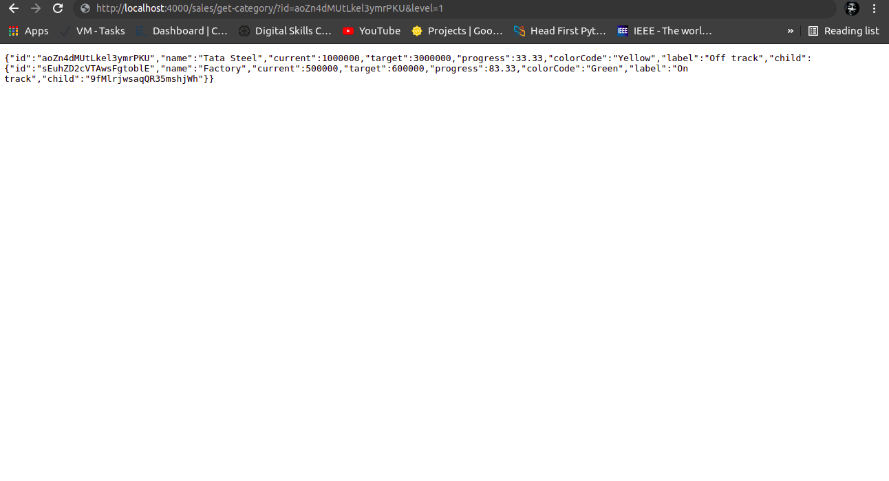

## Some information
1. See through `src/` to find the logic.
2. `src/index.js` is the entry point.
3. U can find all the routes in `src/routes`.
4. U can find all the operation logic in `src/utils`.

## Screenshots

